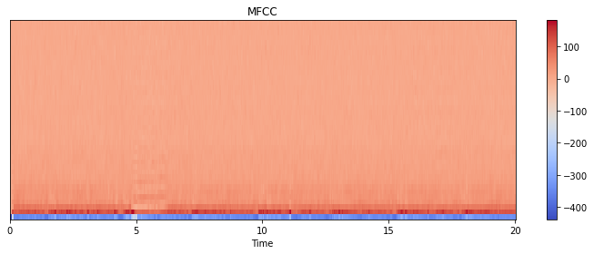
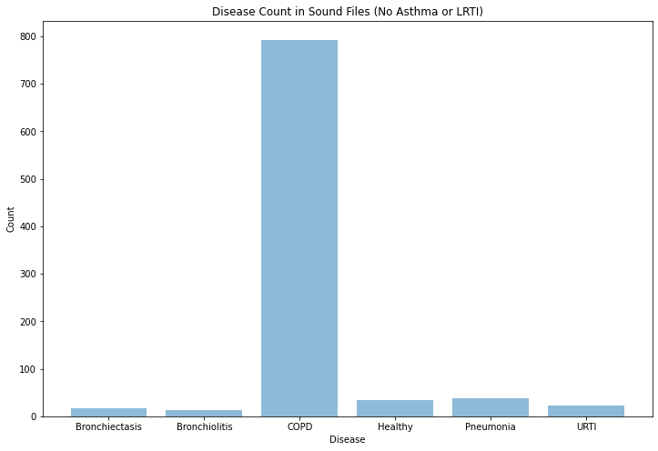
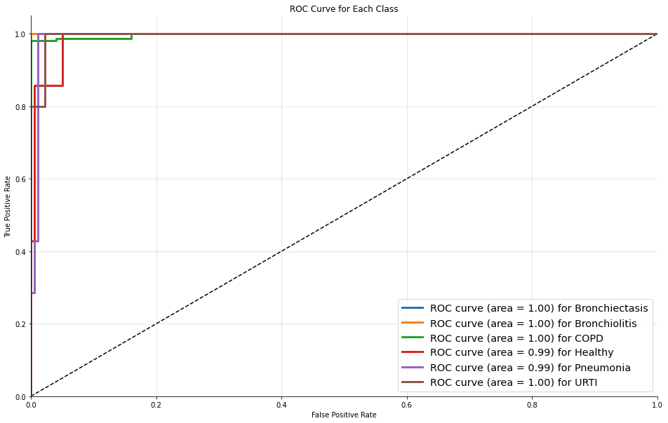
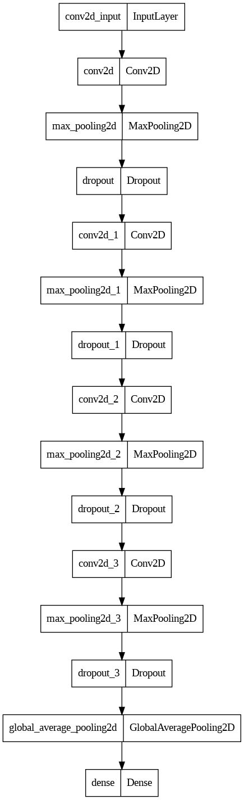

In this notebook we'll use TensorFlow to train a model to classify pulmonary diseases + predicted confidence based on respiratory sound recordings. There will be 6 categories of diseases, namely Healthy, Bronchiectasis, Bronchiolitis, Chronic Obstructive Pulmonary Disease, Pneumonia, and Upper Respiratory Tract Infection. The data was downloaded from [here]( https://bhichallenge.med.auth.gr/).

---

🚨 _Note that running this on CPU is sloooow. If running on Google Colab you can avoid this by going to **Runtime > Change runtime type > Hardware accelerator > GPU > GPU type > T4**. This should be included within the free tier of Colab._

---

We start by doing a `pip install` of all required libraries.


```python
#Import libraries

from datetime import datetime
from os import listdir
from os.path import isfile, join
import shutil

import librosa
import librosa.display

import numpy as np
import pandas as pd

from keras.models import Sequential
from keras.layers import Dense, Dropout, Conv2D, MaxPooling2D, GlobalAveragePooling2D
from keras.utils import to_categorical, plot_model
from keras.callbacks import ModelCheckpoint
from keras.models import load_model

from sklearn.metrics import confusion_matrix, classification_report, roc_curve, auc
from sklearn.model_selection import train_test_split
from sklearn.preprocessing import LabelEncoder

import matplotlib.pyplot as plt
import seaborn as sns
```


```python
!pip show tensorflow
```

    Name: tensorflow
    Version: 2.11.0
    Summary: TensorFlow is an open source machine learning framework for everyone.
    Home-page: https://www.tensorflow.org/
    Author: Google Inc.
    Author-email: packages@tensorflow.org
    License: Apache 2.0
    Location: /usr/local/lib/python3.9/dist-packages
    Requires: absl-py, astunparse, flatbuffers, gast, google-pasta, grpcio, h5py, keras, libclang, numpy, opt-einsum, packaging, protobuf, setuptools, six, tensorboard, tensorflow-estimator, tensorflow-io-gcs-filesystem, termcolor, typing-extensions, wrapt
    Required-by: 
    


```python
shutil.copytree('/content/Respiratory_Sound_Database', '/content/drive/MyDrive/Colab Notebooks/resp_sound_db')
```


    '/content/drive/MyDrive/Colab Notebooks/resp_sound_db'


```python
!mkdir ~/.kaggle
```


```python
from google.colab import files
files.upload()
```


     <input type="file" id="files-cd3dfc0b-ec3d-42a5-bbf0-540b760beec6" name="files[]" multiple disabled
        style="border:none" />
     <output id="result-cd3dfc0b-ec3d-42a5-bbf0-540b760beec6">
      Upload widget is only available when the cell has been executed in the
      current browser session. Please rerun this cell to enable.
      </output>
      <script>// Copyright 2017 Google LLC
//
// Licensed under the Apache License, Version 2.0 (the "License");
// you may not use this file except in compliance with the License.
// You may obtain a copy of the License at
//
//      http://www.apache.org/licenses/LICENSE-2.0
//
// Unless required by applicable law or agreed to in writing, software
// distributed under the License is distributed on an "AS IS" BASIS,
// WITHOUT WARRANTIES OR CONDITIONS OF ANY KIND, either express or implied.
// See the License for the specific language governing permissions and
// limitations under the License.

/**
 * @fileoverview Helpers for google.colab Python module.
 */
(function(scope) {
function span(text, styleAttributes = {}) {
  const element = document.createElement('span');
  element.textContent = text;
  for (const key of Object.keys(styleAttributes)) {
    element.style[key] = styleAttributes[key];
  }
  return element;
}

// Max number of bytes which will be uploaded at a time.
const MAX_PAYLOAD_SIZE = 100 * 1024;

function _uploadFiles(inputId, outputId) {
  const steps = uploadFilesStep(inputId, outputId);
  const outputElement = document.getElementById(outputId);
  // Cache steps on the outputElement to make it available for the next call
  // to uploadFilesContinue from Python.
  outputElement.steps = steps;

  return _uploadFilesContinue(outputId);
}

// This is roughly an async generator (not supported in the browser yet),
// where there are multiple asynchronous steps and the Python side is going
// to poll for completion of each step.
// This uses a Promise to block the python side on completion of each step,
// then passes the result of the previous step as the input to the next step.
function _uploadFilesContinue(outputId) {
  const outputElement = document.getElementById(outputId);
  const steps = outputElement.steps;

  const next = steps.next(outputElement.lastPromiseValue);
  return Promise.resolve(next.value.promise).then((value) => {
    // Cache the last promise value to make it available to the next
    // step of the generator.
    outputElement.lastPromiseValue = value;
    return next.value.response;
  });
}

/**
 * Generator function which is called between each async step of the upload
 * process.
 * @param {string} inputId Element ID of the input file picker element.
 * @param {string} outputId Element ID of the output display.
 * @return {!Iterable<!Object>} Iterable of next steps.
 */
function* uploadFilesStep(inputId, outputId) {
  const inputElement = document.getElementById(inputId);
  inputElement.disabled = false;

  const outputElement = document.getElementById(outputId);
  outputElement.innerHTML = '';

  const pickedPromise = new Promise((resolve) => {
    inputElement.addEventListener('change', (e) => {
      resolve(e.target.files);
    });
  });

  const cancel = document.createElement('button');
  inputElement.parentElement.appendChild(cancel);
  cancel.textContent = 'Cancel upload';
  const cancelPromise = new Promise((resolve) => {
    cancel.onclick = () => {
      resolve(null);
    };
  });

  // Wait for the user to pick the files.
  const files = yield {
    promise: Promise.race([pickedPromise, cancelPromise]),
    response: {
      action: 'starting',
    }
  };

  cancel.remove();

  // Disable the input element since further picks are not allowed.
  inputElement.disabled = true;

  if (!files) {
    return {
      response: {
        action: 'complete',
      }
    };
  }

  for (const file of files) {
    const li = document.createElement('li');
    li.append(span(file.name, {fontWeight: 'bold'}));
    li.append(span(
        `(${file.type || 'n/a'}) - ${file.size} bytes, ` +
        `last modified: ${
            file.lastModifiedDate ? file.lastModifiedDate.toLocaleDateString() :
                                    'n/a'} - `));
    const percent = span('0% done');
    li.appendChild(percent);

    outputElement.appendChild(li);

    const fileDataPromise = new Promise((resolve) => {
      const reader = new FileReader();
      reader.onload = (e) => {
        resolve(e.target.result);
      };
      reader.readAsArrayBuffer(file);
    });
    // Wait for the data to be ready.
    let fileData = yield {
      promise: fileDataPromise,
      response: {
        action: 'continue',
      }
    };

    // Use a chunked sending to avoid message size limits. See b/62115660.
    let position = 0;
    do {
      const length = Math.min(fileData.byteLength - position, MAX_PAYLOAD_SIZE);
      const chunk = new Uint8Array(fileData, position, length);
      position += length;

      const base64 = btoa(String.fromCharCode.apply(null, chunk));
      yield {
        response: {
          action: 'append',
          file: file.name,
          data: base64,
        },
      };

      let percentDone = fileData.byteLength === 0 ?
          100 :
          Math.round((position / fileData.byteLength) * 100);
      percent.textContent = `${percentDone}% done`;

    } while (position < fileData.byteLength);
  }

  // All done.
  yield {
    response: {
      action: 'complete',
    }
  };
}

scope.google = scope.google || {};
scope.google.colab = scope.google.colab || {};
scope.google.colab._files = {
  _uploadFiles,
  _uploadFilesContinue,
};
})(self);
</script> 


    Saving kaggle.json to kaggle.json
    


    {'kaggle.json': b'{"username":"jind0sh","key":"70feb1dabda22b9d83b7c260b3bf4ee4"}'}


```python
!cp kaggle.json ~/.kaggle
```


```python
!chmod 600 ~/.kaggle/kaggle.json
```


```python
!kaggle datasets list
```

    ref                                                                title                                            size  lastUpdated          downloadCount  voteCount  usabilityRating  
    -----------------------------------------------------------------  ----------------------------------------------  -----  -------------------  -------------  ---------  ---------------  
    themrityunjaypathak/covid-cases-and-deaths-worldwide               Covid Cases and Deaths WorldWide                  8KB  2023-02-01 12:22:51           6132        182  1.0              
    amaanansari09/top-100-songs                                        Top 100 songs                                     6KB  2023-02-16 18:55:35            852         29  1.0              
    datascientistanna/customers-dataset                                Shop Customer Data                               23KB  2023-02-07 18:42:21           4713        118  1.0              
    thedevastator/airbnb-prices-in-european-cities                     Airbnb Prices in European Cities                  4MB  2023-02-20 09:48:04            864         29  1.0              
    rajugc/imdb-top-250-movies-dataset                                 IMDB Top 250 Movies Dataset                      52KB  2023-02-11 16:02:01           2142         55  1.0              
    ksabishek/product-sales-data                                       Product Sales Data                              135KB  2023-02-11 07:08:50            909         34  1.0              
    karkavelrajaj/amazon-sales-dataset                                 Amazon Sales Dataset                              2MB  2023-01-17 06:21:15           7405        119  1.0              
    mdazizulkabirlovlu/all-countries-temperature-statistics-1970-2021  All Countries Temperature Statistics 1970-2021   26KB  2023-02-22 09:58:55            348         22  0.9411765        
    thedevastator/apple-s-historical-financials                        Apple's Historical Financials                     1KB  2023-02-13 11:33:03            695         23  1.0              
    themrityunjaypathak/tesla-stock-price-2005-2023                    Tesla Stock Price [2005-2023]                    53KB  2023-02-15 06:47:17            758         23  1.0              
    rajugc/imdb-movies-dataset-based-on-genre                          IMDb Movie Dataset: All Movies by Genre          43MB  2023-02-17 04:04:49            897         32  1.0              
    synful/world-happiness-report                                      World Happiness Report                           37KB  2023-02-15 13:53:43            742         22  0.7058824        
    ahsan81/hotel-reservations-classification-dataset                  Hotel Reservations Dataset                      480KB  2023-01-04 12:50:31          14118        420  1.0              
    thedevastator/u-s-software-developer-salaries                      U.S. Software Developer Salaries                  4KB  2023-02-11 03:18:23            779         28  1.0              
    googleai/musiccaps                                                 MusicCaps                                       793KB  2023-01-25 09:25:48           3476        280  0.9411765        
    mattop/nutrition-physical-activity-and-obesity                     Nutrition, Physical Activity, and Obesity         3MB  2023-02-12 15:24:33           1422         40  1.0              
    jahaidulislam/world-happiness-report-2005-2021                     World Happiness Report 2005-2021                115KB  2023-02-22 10:46:42            357         26  1.0              
    jahaidulislam/fifa-world-cup-all-goals-1930-2022-dataset           FIFA World Cup All Goals 1930-2022 Dataset       73KB  2023-02-21 06:39:57            433         23  0.9411765        
    firozkabir1/crime-statistics-of-bangladesh-2010-2019               Crime Statistics Of Bangladesh 2010-2019          5KB  2023-02-21 20:48:06            338         25  1.0              
    thedevastator/domestic-food-prices-after-covid-19                  Domestic Food Prices After COVID-19               1MB  2023-02-13 01:45:15           1524         36  0.9411765        
    


```python
!kaggle datasets download vbookshelf/respiratory-sound-database -p /content/ --unzip
```

    Downloading respiratory-sound-database.zip to /content
    100% 3.68G/3.69G [00:30<00:00, 55.5MB/s]
    100% 3.69G/3.69G [00:30<00:00, 128MB/s] 
    


```python
mypath = "./Respiratory_Sound_Database/Respiratory_Sound_Database/audio_and_txt_files/"
filenames = [f for f in listdir(mypath) if (isfile(join(mypath, f)) and f.endswith('.wav'))]
```


```python
p_id_in_file = [] # patient IDs corresponding to each file
for name in filenames:
    p_id_in_file.append(int(name[:3]))

p_id_in_file = np.array(p_id_in_file)
```


```python
max_pad_len = 862 # to make the length of all MFCC equal

def extract_features(file_name):
  """
  This function takes in the path for an audio file as a string,
  loads it, and returns the MFCC of the audio
  """
  try:
    audio, sample_rate = librosa.load(file_name, res_type='kaiser_fast', duration=20)
    mfccs = librosa.feature.mfcc(y=audio, sr=sample_rate, n_mfcc=40)
    pad_width = max_pad_len - mfccs.shape[1]
    mfccs = np.pad(mfccs, pad_width=((0, 0), (0, pad_width)), mode='constant')

  except Exception as e:
    print("Error encountered while parsing file: ", file_name)
    return None

  return mfccs
```


```python
filepaths = [join(mypath, f) for f in filenames] # full paths of files
```


```python
p_diag = pd.read_csv("./Respiratory_Sound_Database/Respiratory_Sound_Database/patient_diagnosis.csv", header=None) # patient diagnosis file
```


```python
labels = np.array([p_diag[p_diag[0] == x][1].values[0] for x in p_id_in_file])
```


```python
features = []

# Iterate through each sound file and extract the features
for file_name in filepaths:
  data = extract_features(file_name)
  features.append(data)

print('Finished feature extraction from ', len(features), ' files')
features = np.array(features)
```

    Finished feature extraction from  920  files
    


```python
# plot an MFCC
plt.figure(figsize=(10, 4))
librosa.display.specshow(features[7], x_axis='time')
plt.colorbar()
plt.title('MFCC')
plt.tight_layout()
plt.show()
```


    

    


```python
features = np.array(features) # convert to numpy array
```


```python
# Delete the rarer diseases

features1 = np.delete(features, np.where((labels == 'Asthma') | (labels == 'LRTI'))[0], axis=0)

labels1 = np.delete(labels, np.where((labels == 'Asthma') | (labels == 'LRTI'))[0], axis=0)
```


```python
# Print class counts
unique_elements, counts_elements = np.unique(labels1, return_counts=True)
print(np.asarray((unique_elements, counts_elements)))
```

    [['Bronchiectasis' 'Bronchiolitis' 'COPD' 'Healthy' 'Pneumonia' 'URTI']
     ['16' '13' '793' '35' '37' '23']]
    


```python
# Plot class counts
y_pos = np.arange(len(unique_elements))
plt.figure(figsize=(12, 8))
plt.bar(unique_elements, counts_elements, align='center', alpha=0.5)
plt.xticks(y_pos, unique_elements)
plt.ylabel('Count')
plt.xlabel('Disease')
plt.title('Disease Count in Sound Files (No Asthma or LRTI)')
plt.show()
```


    

    


```python
# One-hot encode labels
le = LabelEncoder()
i_labels = le.fit_transform(labels1)
oh_labels = to_categorical(i_labels)
```


```python
# Add channel dimension for CNN
features1 = np.reshape(features1, (*features1.shape,1))
```


```python
# Train test split
x_train, x_test, y_train, y_test = train_test_split(features1, oh_labels, stratify=oh_labels,
                                                    test_size=0.2, random_state=42)
```

# Convolutional Neural Network (CNN) model architecture

Our model will be a Convolutional Neural Network (CNN) using Keras and a Tensorflow backend.

**We will use a sequential model, with a simple model architecture, consisting of four Conv2D convolution layers, with our final output layer being a dense layer.**

The convolution layers are designed for feature detection. It works by sliding a filter window over the input and performing a matrix multiplication and storing the result in a feature map. This operation is known as a convolution.

The filter parameter specifies the number of nodes in each layer. Each layer will increase in size from 16, 32, 64 to 128, while the kernel_size parameter specifies the size of the kernel window which in this case is 2 resulting in a 2x2 filter matrix.

**The first layer will receive the input shape of (40, 862, 1) where 40 is the number of MFCC's, 862 is the number of frames taking padding into account and the 1 signifying that the audio is mono.**

**The activation function we will be using for our convolutional layers is ReLU. We will use a small Dropout value of 20% on our convolutional layers.**

Each convolutional layer has an associated pooling layer of **MaxPooling2D** type with the final convolutional layer having a **GlobalAveragePooling2D** type. The pooling layer is to **reduce the dimensionality of the model** (by reducing the parameters and subsequent computation requirements) which serves to **shorten the training time and reduce overfitting**. **The Max Pooling type takes the maximum size for each window and the Global Average Pooling type takes the average which is suitable for feeding into our dense output layer.**

Our output layer will have 6 nodes (num_labels) which matches the number of possible classifications. The activation is for our output layer is **softmax**. Softmax makes the output sum up to 1 so the output can be interpreted as probabilities. The model will then make its prediction based on which option has the highest probability.


```python
from prompt_toolkit import filters
num_rows = 40
num_columns = 862
num_channels = 1

num_labels = oh_labels.shape[1]
filter_size = 2

# Construct model
model = Sequential()
model.add(Conv2D(filters=16, kernel_size=filter_size,
                 input_shape=(num_rows, num_columns, num_channels),
                 activation='relu'))
model.add(MaxPooling2D(pool_size=2))
model.add(Dropout(0.2))

model.add(Conv2D(filters=32, kernel_size=filter_size, activation='relu'))
model.add(MaxPooling2D(pool_size=2))
model.add(Dropout(0.2))

model.add(Conv2D(filters=64, kernel_size=filter_size, activation='relu'))
model.add(MaxPooling2D(pool_size=2))
model.add(Dropout(0.2))

model.add(Conv2D(filters=128, kernel_size=filter_size, activation='relu'))
model.add(MaxPooling2D(pool_size=2))
model.add(Dropout(0.2))

model.add(GlobalAveragePooling2D())

model.add(Dense(num_labels, activation='softmax'))
```


```python
model.compile(loss='categorical_crossentropy', metrics=['accuracy'], optimizer='adam')
```


```python
# Display model architecture summary
model.summary()

# Calculate pre-training accuracy
score = model.evaluate(x_test, y_test, verbose=1)
accuracy = 100*score[1]

print("Pre-training accuracy: %.4f%%" % accuracy)
```

    Model: "sequential"
    _________________________________________________________________
     Layer (type)                Output Shape              Param #   
    =================================================================
     conv2d (Conv2D)             (None, 39, 861, 16)       80        
                                                                     
     max_pooling2d (MaxPooling2D  (None, 19, 430, 16)      0         
     )                                                               
                                                                     
     dropout (Dropout)           (None, 19, 430, 16)       0         
                                                                     
     conv2d_1 (Conv2D)           (None, 18, 429, 32)       2080      
                                                                     
     max_pooling2d_1 (MaxPooling  (None, 9, 214, 32)       0         
     2D)                                                             
                                                                     
     dropout_1 (Dropout)         (None, 9, 214, 32)        0         
                                                                     
     conv2d_2 (Conv2D)           (None, 8, 213, 64)        8256      
                                                                     
     max_pooling2d_2 (MaxPooling  (None, 4, 106, 64)       0         
     2D)                                                             
                                                                     
     dropout_2 (Dropout)         (None, 4, 106, 64)        0         
                                                                     
     conv2d_3 (Conv2D)           (None, 3, 105, 128)       32896     
                                                                     
     max_pooling2d_3 (MaxPooling  (None, 1, 52, 128)       0         
     2D)                                                             
                                                                     
     dropout_3 (Dropout)         (None, 1, 52, 128)        0         
                                                                     
     global_average_pooling2d (G  (None, 128)              0         
     lobalAveragePooling2D)                                          
                                                                     
     dense (Dense)               (None, 6)                 774       
                                                                     
    =================================================================
    Total params: 44,086
    Trainable params: 44,086
    Non-trainable params: 0
    _________________________________________________________________
    6/6 [==============================] - 1s 211ms/step - loss: 0.1472 - accuracy: 0.9511
    Pre-training accuracy: 95.1087%
    

#Training

Here we will train the model. If we have a trained model, we can load it instead from the next cell.


```python
# Train model
num_epochs = 250
num_batch_size = 128

start = datetime.now()

model.fit(x_train, y_train, batch_size=num_batch_size, epochs=num_epochs,
          validation_data=(x_test, y_test), verbose=1)

duration = datetime.now() - start
print("Training completed in time: ", duration)
```

    Epoch 1/250
    6/6 [==============================] - 25s 4s/step - loss: 3.2176 - accuracy: 0.6671 - val_loss: 1.4691 - val_accuracy: 0.8641
    Epoch 2/250
    6/6 [==============================] - 25s 4s/step - loss: 3.0482 - accuracy: 0.8308 - val_loss: 1.0810 - val_accuracy: 0.8641
    Epoch 3/250
    6/6 [==============================] - 23s 4s/step - loss: 1.8893 - accuracy: 0.8254 - val_loss: 1.1302 - val_accuracy: 0.7120
    Epoch 4/250
    6/6 [==============================] - 24s 4s/step - loss: 1.2490 - accuracy: 0.8226 - val_loss: 0.7763 - val_accuracy: 0.8641
    Epoch 5/250
    6/6 [==============================] - 23s 4s/step - loss: 1.0296 - accuracy: 0.8445 - val_loss: 0.7326 - val_accuracy: 0.8641
    Epoch 6/250
    6/6 [==============================] - 23s 4s/step - loss: 0.7437 - accuracy: 0.8554 - val_loss: 0.8248 - val_accuracy: 0.8207
    Epoch 7/250
    6/6 [==============================] - 25s 4s/step - loss: 0.6057 - accuracy: 0.8445 - val_loss: 1.0196 - val_accuracy: 0.6793
    Epoch 8/250
    6/6 [==============================] - 24s 4s/step - loss: 0.5939 - accuracy: 0.8595 - val_loss: 0.7549 - val_accuracy: 0.8315
    Epoch 9/250
    6/6 [==============================] - 23s 4s/step - loss: 0.5525 - accuracy: 0.8472 - val_loss: 0.8486 - val_accuracy: 0.7663
    Epoch 10/250
    6/6 [==============================] - 23s 4s/step - loss: 0.5348 - accuracy: 0.8472 - val_loss: 0.7859 - val_accuracy: 0.8043
    Epoch 11/250
    6/6 [==============================] - 23s 4s/step - loss: 0.4929 - accuracy: 0.8540 - val_loss: 0.7117 - val_accuracy: 0.8315
    Epoch 12/250
    6/6 [==============================] - 25s 4s/step - loss: 0.4797 - accuracy: 0.8499 - val_loss: 0.6737 - val_accuracy: 0.8315
    Epoch 13/250
    6/6 [==============================] - 23s 4s/step - loss: 0.4634 - accuracy: 0.8499 - val_loss: 0.6692 - val_accuracy: 0.8370
    Epoch 14/250
    6/6 [==============================] - 23s 4s/step - loss: 0.4486 - accuracy: 0.8445 - val_loss: 0.6366 - val_accuracy: 0.8370
    Epoch 15/250
    6/6 [==============================] - 23s 4s/step - loss: 0.4369 - accuracy: 0.8499 - val_loss: 0.5913 - val_accuracy: 0.8370
    Epoch 16/250
    6/6 [==============================] - 23s 4s/step - loss: 0.4421 - accuracy: 0.8458 - val_loss: 0.5845 - val_accuracy: 0.8424
    Epoch 17/250
    6/6 [==============================] - 25s 4s/step - loss: 0.4416 - accuracy: 0.8499 - val_loss: 0.5821 - val_accuracy: 0.8424
    Epoch 18/250
    6/6 [==============================] - 24s 4s/step - loss: 0.4290 - accuracy: 0.8622 - val_loss: 0.5539 - val_accuracy: 0.8424
    Epoch 19/250
    6/6 [==============================] - 23s 4s/step - loss: 0.4171 - accuracy: 0.8513 - val_loss: 0.5571 - val_accuracy: 0.8478
    Epoch 20/250
    6/6 [==============================] - 23s 4s/step - loss: 0.4093 - accuracy: 0.8540 - val_loss: 0.5268 - val_accuracy: 0.8533
    Epoch 21/250
    6/6 [==============================] - 25s 4s/step - loss: 0.3898 - accuracy: 0.8608 - val_loss: 0.5529 - val_accuracy: 0.8478
    Epoch 22/250
    6/6 [==============================] - 23s 4s/step - loss: 0.4146 - accuracy: 0.8649 - val_loss: 0.5129 - val_accuracy: 0.8533
    Epoch 23/250
    6/6 [==============================] - 24s 4s/step - loss: 0.3969 - accuracy: 0.8554 - val_loss: 0.5187 - val_accuracy: 0.8533
    Epoch 24/250
    6/6 [==============================] - 24s 4s/step - loss: 0.3928 - accuracy: 0.8595 - val_loss: 0.4854 - val_accuracy: 0.8587
    Epoch 25/250
    6/6 [==============================] - 24s 4s/step - loss: 0.4013 - accuracy: 0.8649 - val_loss: 0.5213 - val_accuracy: 0.8370
    Epoch 26/250
    6/6 [==============================] - 23s 4s/step - loss: 0.3937 - accuracy: 0.8608 - val_loss: 0.4690 - val_accuracy: 0.8696
    Epoch 27/250
    6/6 [==============================] - 24s 4s/step - loss: 0.4094 - accuracy: 0.8677 - val_loss: 0.4798 - val_accuracy: 0.8696
    Epoch 28/250
    6/6 [==============================] - 24s 4s/step - loss: 0.4034 - accuracy: 0.8636 - val_loss: 0.4926 - val_accuracy: 0.8533
    Epoch 29/250
    6/6 [==============================] - 23s 4s/step - loss: 0.3828 - accuracy: 0.8704 - val_loss: 0.4450 - val_accuracy: 0.8750
    Epoch 30/250
    6/6 [==============================] - 23s 4s/step - loss: 0.3661 - accuracy: 0.8677 - val_loss: 0.4730 - val_accuracy: 0.8587
    Epoch 31/250
    6/6 [==============================] - 25s 4s/step - loss: 0.3630 - accuracy: 0.8581 - val_loss: 0.4522 - val_accuracy: 0.8750
    Epoch 32/250
    6/6 [==============================] - 25s 4s/step - loss: 0.3722 - accuracy: 0.8636 - val_loss: 0.4570 - val_accuracy: 0.8750
    Epoch 33/250
    6/6 [==============================] - 25s 4s/step - loss: 0.3589 - accuracy: 0.8731 - val_loss: 0.4520 - val_accuracy: 0.8804
    Epoch 34/250
    6/6 [==============================] - 25s 4s/step - loss: 0.3398 - accuracy: 0.8745 - val_loss: 0.4474 - val_accuracy: 0.8750
    Epoch 35/250
    6/6 [==============================] - 24s 4s/step - loss: 0.3572 - accuracy: 0.8704 - val_loss: 0.4400 - val_accuracy: 0.8750
    Epoch 36/250
    6/6 [==============================] - 24s 4s/step - loss: 0.3400 - accuracy: 0.8799 - val_loss: 0.4338 - val_accuracy: 0.8750
    Epoch 37/250
    6/6 [==============================] - 23s 4s/step - loss: 0.3359 - accuracy: 0.8718 - val_loss: 0.4379 - val_accuracy: 0.8641
    Epoch 38/250
    6/6 [==============================] - 24s 4s/step - loss: 0.3355 - accuracy: 0.8690 - val_loss: 0.4314 - val_accuracy: 0.8641
    Epoch 39/250
    6/6 [==============================] - 25s 4s/step - loss: 0.3287 - accuracy: 0.8772 - val_loss: 0.4254 - val_accuracy: 0.8641
    Epoch 40/250
    6/6 [==============================] - 23s 4s/step - loss: 0.3183 - accuracy: 0.8895 - val_loss: 0.4307 - val_accuracy: 0.8641
    Epoch 41/250
    6/6 [==============================] - 24s 4s/step - loss: 0.3232 - accuracy: 0.8759 - val_loss: 0.4323 - val_accuracy: 0.8587
    Epoch 42/250
    6/6 [==============================] - 23s 4s/step - loss: 0.3033 - accuracy: 0.8881 - val_loss: 0.4214 - val_accuracy: 0.8641
    Epoch 43/250
    6/6 [==============================] - 22s 4s/step - loss: 0.3388 - accuracy: 0.8799 - val_loss: 0.4277 - val_accuracy: 0.8587
    Epoch 44/250
    6/6 [==============================] - 26s 4s/step - loss: 0.3240 - accuracy: 0.8840 - val_loss: 0.4182 - val_accuracy: 0.8641
    Epoch 45/250
    6/6 [==============================] - 25s 4s/step - loss: 0.3015 - accuracy: 0.8827 - val_loss: 0.4284 - val_accuracy: 0.8641
    Epoch 46/250
    6/6 [==============================] - 23s 4s/step - loss: 0.2955 - accuracy: 0.8936 - val_loss: 0.4271 - val_accuracy: 0.8587
    Epoch 47/250
    6/6 [==============================] - 23s 4s/step - loss: 0.3070 - accuracy: 0.8881 - val_loss: 0.4123 - val_accuracy: 0.8641
    Epoch 48/250
    6/6 [==============================] - 22s 4s/step - loss: 0.3077 - accuracy: 0.8950 - val_loss: 0.4193 - val_accuracy: 0.8587
    Epoch 49/250
    6/6 [==============================] - 23s 4s/step - loss: 0.3123 - accuracy: 0.8909 - val_loss: 0.4285 - val_accuracy: 0.8641
    Epoch 50/250
    6/6 [==============================] - 24s 4s/step - loss: 0.3183 - accuracy: 0.8786 - val_loss: 0.4119 - val_accuracy: 0.8641
    Epoch 51/250
    6/6 [==============================] - 23s 4s/step - loss: 0.3111 - accuracy: 0.8881 - val_loss: 0.4405 - val_accuracy: 0.8587
    Epoch 52/250
    6/6 [==============================] - 23s 4s/step - loss: 0.3082 - accuracy: 0.8922 - val_loss: 0.4038 - val_accuracy: 0.8641
    Epoch 53/250
    6/6 [==============================] - 23s 4s/step - loss: 0.2844 - accuracy: 0.8881 - val_loss: 0.4226 - val_accuracy: 0.8587
    Epoch 54/250
    6/6 [==============================] - 26s 4s/step - loss: 0.3104 - accuracy: 0.8936 - val_loss: 0.4134 - val_accuracy: 0.8696
    Epoch 55/250
    6/6 [==============================] - 25s 4s/step - loss: 0.2787 - accuracy: 0.8922 - val_loss: 0.4126 - val_accuracy: 0.8587
    Epoch 56/250
    6/6 [==============================] - 23s 4s/step - loss: 0.2664 - accuracy: 0.9045 - val_loss: 0.4175 - val_accuracy: 0.8587
    Epoch 57/250
    6/6 [==============================] - 23s 4s/step - loss: 0.2579 - accuracy: 0.9031 - val_loss: 0.4116 - val_accuracy: 0.8641
    Epoch 58/250
    6/6 [==============================] - 24s 4s/step - loss: 0.2588 - accuracy: 0.9018 - val_loss: 0.4176 - val_accuracy: 0.8641
    Epoch 59/250
    6/6 [==============================] - 24s 4s/step - loss: 0.2512 - accuracy: 0.9072 - val_loss: 0.4148 - val_accuracy: 0.8587
    Epoch 60/250
    6/6 [==============================] - 23s 4s/step - loss: 0.2688 - accuracy: 0.8977 - val_loss: 0.4064 - val_accuracy: 0.8696
    Epoch 61/250
    6/6 [==============================] - 25s 4s/step - loss: 0.2499 - accuracy: 0.9154 - val_loss: 0.4344 - val_accuracy: 0.8587
    Epoch 62/250
    6/6 [==============================] - 23s 4s/step - loss: 0.2519 - accuracy: 0.9113 - val_loss: 0.4221 - val_accuracy: 0.8641
    Epoch 63/250
    6/6 [==============================] - 25s 4s/step - loss: 0.2433 - accuracy: 0.9072 - val_loss: 0.4218 - val_accuracy: 0.8587
    Epoch 64/250
    6/6 [==============================] - 23s 4s/step - loss: 0.2559 - accuracy: 0.8950 - val_loss: 0.4273 - val_accuracy: 0.8641
    Epoch 65/250
    6/6 [==============================] - 23s 4s/step - loss: 0.2559 - accuracy: 0.9031 - val_loss: 0.4273 - val_accuracy: 0.8696
    Epoch 66/250
    6/6 [==============================] - 23s 4s/step - loss: 0.2498 - accuracy: 0.9195 - val_loss: 0.4192 - val_accuracy: 0.8641
    Epoch 67/250
    6/6 [==============================] - 23s 4s/step - loss: 0.2623 - accuracy: 0.9004 - val_loss: 0.4192 - val_accuracy: 0.8696
    Epoch 68/250
    6/6 [==============================] - 22s 4s/step - loss: 0.2855 - accuracy: 0.9031 - val_loss: 0.4352 - val_accuracy: 0.8696
    Epoch 69/250
    6/6 [==============================] - 23s 4s/step - loss: 0.2568 - accuracy: 0.9018 - val_loss: 0.4066 - val_accuracy: 0.8750
    Epoch 70/250
    6/6 [==============================] - 23s 4s/step - loss: 0.2665 - accuracy: 0.9031 - val_loss: 0.4463 - val_accuracy: 0.8696
    Epoch 71/250
    6/6 [==============================] - 23s 4s/step - loss: 0.2484 - accuracy: 0.9072 - val_loss: 0.4196 - val_accuracy: 0.8696
    Epoch 72/250
    6/6 [==============================] - 22s 4s/step - loss: 0.2319 - accuracy: 0.9154 - val_loss: 0.4077 - val_accuracy: 0.8696
    Epoch 73/250
    6/6 [==============================] - 24s 4s/step - loss: 0.2325 - accuracy: 0.9018 - val_loss: 0.4246 - val_accuracy: 0.8696
    Epoch 74/250
    6/6 [==============================] - 25s 4s/step - loss: 0.2394 - accuracy: 0.9127 - val_loss: 0.4185 - val_accuracy: 0.8696
    Epoch 75/250
    6/6 [==============================] - 23s 4s/step - loss: 0.2347 - accuracy: 0.9127 - val_loss: 0.4162 - val_accuracy: 0.8696
    Epoch 76/250
    6/6 [==============================] - 23s 4s/step - loss: 0.2225 - accuracy: 0.9332 - val_loss: 0.4197 - val_accuracy: 0.8696
    Epoch 77/250
    6/6 [==============================] - 25s 4s/step - loss: 0.2375 - accuracy: 0.9113 - val_loss: 0.4179 - val_accuracy: 0.8696
    Epoch 78/250
    6/6 [==============================] - 24s 4s/step - loss: 0.2049 - accuracy: 0.9332 - val_loss: 0.4170 - val_accuracy: 0.8696
    Epoch 79/250
    6/6 [==============================] - 25s 4s/step - loss: 0.2119 - accuracy: 0.9222 - val_loss: 0.4230 - val_accuracy: 0.8641
    Epoch 80/250
    6/6 [==============================] - 25s 4s/step - loss: 0.2132 - accuracy: 0.9195 - val_loss: 0.4270 - val_accuracy: 0.8696
    Epoch 81/250
    6/6 [==============================] - 24s 4s/step - loss: 0.2293 - accuracy: 0.9113 - val_loss: 0.4426 - val_accuracy: 0.8696
    Epoch 82/250
    6/6 [==============================] - 24s 4s/step - loss: 0.2296 - accuracy: 0.9154 - val_loss: 0.4322 - val_accuracy: 0.8641
    Epoch 83/250
    6/6 [==============================] - 26s 4s/step - loss: 0.2187 - accuracy: 0.9100 - val_loss: 0.4291 - val_accuracy: 0.8696
    Epoch 84/250
    6/6 [==============================] - 24s 4s/step - loss: 0.2077 - accuracy: 0.9250 - val_loss: 0.4286 - val_accuracy: 0.8696
    Epoch 85/250
    6/6 [==============================] - 24s 4s/step - loss: 0.2177 - accuracy: 0.9195 - val_loss: 0.4231 - val_accuracy: 0.8750
    Epoch 86/250
    6/6 [==============================] - 23s 4s/step - loss: 0.2072 - accuracy: 0.9168 - val_loss: 0.4500 - val_accuracy: 0.8696
    Epoch 87/250
    6/6 [==============================] - 22s 4s/step - loss: 0.2183 - accuracy: 0.9195 - val_loss: 0.4349 - val_accuracy: 0.8750
    Epoch 88/250
    6/6 [==============================] - 24s 4s/step - loss: 0.1947 - accuracy: 0.9236 - val_loss: 0.4302 - val_accuracy: 0.8804
    Epoch 89/250
    6/6 [==============================] - 24s 4s/step - loss: 0.1859 - accuracy: 0.9291 - val_loss: 0.4330 - val_accuracy: 0.8750
    Epoch 90/250
    6/6 [==============================] - 23s 4s/step - loss: 0.2066 - accuracy: 0.9236 - val_loss: 0.4429 - val_accuracy: 0.8696
    Epoch 91/250
    6/6 [==============================] - 23s 4s/step - loss: 0.1942 - accuracy: 0.9291 - val_loss: 0.4495 - val_accuracy: 0.8696
    Epoch 92/250
    6/6 [==============================] - 25s 4s/step - loss: 0.1885 - accuracy: 0.9222 - val_loss: 0.4451 - val_accuracy: 0.8587
    Epoch 93/250
    6/6 [==============================] - 23s 4s/step - loss: 0.1872 - accuracy: 0.9263 - val_loss: 0.4423 - val_accuracy: 0.8750
    Epoch 94/250
    6/6 [==============================] - 23s 4s/step - loss: 0.1777 - accuracy: 0.9345 - val_loss: 0.4502 - val_accuracy: 0.8750
    Epoch 95/250
    6/6 [==============================] - 23s 4s/step - loss: 0.1756 - accuracy: 0.9318 - val_loss: 0.4440 - val_accuracy: 0.8641
    Epoch 96/250
    6/6 [==============================] - 23s 4s/step - loss: 0.1776 - accuracy: 0.9304 - val_loss: 0.4568 - val_accuracy: 0.8750
    Epoch 97/250
    6/6 [==============================] - 23s 4s/step - loss: 0.1741 - accuracy: 0.9359 - val_loss: 0.4678 - val_accuracy: 0.8804
    Epoch 98/250
    6/6 [==============================] - 23s 4s/step - loss: 0.1913 - accuracy: 0.9263 - val_loss: 0.4506 - val_accuracy: 0.8750
    Epoch 99/250
    6/6 [==============================] - 24s 4s/step - loss: 0.1833 - accuracy: 0.9304 - val_loss: 0.4474 - val_accuracy: 0.8804
    Epoch 100/250
    6/6 [==============================] - 23s 4s/step - loss: 0.1809 - accuracy: 0.9304 - val_loss: 0.4571 - val_accuracy: 0.8750
    Epoch 101/250
    6/6 [==============================] - 22s 4s/step - loss: 0.1597 - accuracy: 0.9332 - val_loss: 0.4647 - val_accuracy: 0.8750
    Epoch 102/250
    6/6 [==============================] - 26s 4s/step - loss: 0.1707 - accuracy: 0.9250 - val_loss: 0.4688 - val_accuracy: 0.8641
    Epoch 103/250
    6/6 [==============================] - 24s 4s/step - loss: 0.1699 - accuracy: 0.9318 - val_loss: 0.4690 - val_accuracy: 0.8750
    Epoch 104/250
    6/6 [==============================] - 23s 4s/step - loss: 0.1662 - accuracy: 0.9372 - val_loss: 0.4748 - val_accuracy: 0.8750
    Epoch 105/250
    6/6 [==============================] - 23s 4s/step - loss: 0.1828 - accuracy: 0.9345 - val_loss: 0.4560 - val_accuracy: 0.8750
    Epoch 106/250
    6/6 [==============================] - 22s 4s/step - loss: 0.1658 - accuracy: 0.9345 - val_loss: 0.4691 - val_accuracy: 0.8750
    Epoch 107/250
    6/6 [==============================] - 23s 4s/step - loss: 0.1602 - accuracy: 0.9441 - val_loss: 0.4704 - val_accuracy: 0.8750
    Epoch 108/250
    6/6 [==============================] - 23s 4s/step - loss: 0.1493 - accuracy: 0.9400 - val_loss: 0.4680 - val_accuracy: 0.8696
    Epoch 109/250
    6/6 [==============================] - 23s 4s/step - loss: 0.1598 - accuracy: 0.9400 - val_loss: 0.4828 - val_accuracy: 0.8750
    Epoch 110/250
    6/6 [==============================] - 23s 4s/step - loss: 0.1498 - accuracy: 0.9413 - val_loss: 0.4835 - val_accuracy: 0.8750
    Epoch 111/250
    6/6 [==============================] - 25s 4s/step - loss: 0.1463 - accuracy: 0.9427 - val_loss: 0.4751 - val_accuracy: 0.8750
    Epoch 112/250
    6/6 [==============================] - 24s 4s/step - loss: 0.1434 - accuracy: 0.9454 - val_loss: 0.5229 - val_accuracy: 0.8750
    Epoch 113/250
    6/6 [==============================] - 23s 4s/step - loss: 0.1473 - accuracy: 0.9468 - val_loss: 0.4903 - val_accuracy: 0.8750
    Epoch 114/250
    6/6 [==============================] - 22s 4s/step - loss: 0.1719 - accuracy: 0.9250 - val_loss: 0.5283 - val_accuracy: 0.8750
    Epoch 115/250
    6/6 [==============================] - 23s 4s/step - loss: 0.1758 - accuracy: 0.9318 - val_loss: 0.5582 - val_accuracy: 0.8750
    Epoch 116/250
    6/6 [==============================] - 24s 4s/step - loss: 0.1833 - accuracy: 0.9304 - val_loss: 0.4985 - val_accuracy: 0.8696
    Epoch 117/250
    6/6 [==============================] - 22s 4s/step - loss: 0.1391 - accuracy: 0.9454 - val_loss: 0.4908 - val_accuracy: 0.8750
    Epoch 118/250
    6/6 [==============================] - 24s 4s/step - loss: 0.1441 - accuracy: 0.9427 - val_loss: 0.4933 - val_accuracy: 0.8750
    Epoch 119/250
    6/6 [==============================] - 23s 4s/step - loss: 0.1387 - accuracy: 0.9468 - val_loss: 0.5094 - val_accuracy: 0.8750
    Epoch 120/250
    6/6 [==============================] - 25s 4s/step - loss: 0.1467 - accuracy: 0.9400 - val_loss: 0.4992 - val_accuracy: 0.8750
    Epoch 121/250
    6/6 [==============================] - 23s 4s/step - loss: 0.1435 - accuracy: 0.9400 - val_loss: 0.5102 - val_accuracy: 0.8750
    Epoch 122/250
    6/6 [==============================] - 26s 4s/step - loss: 0.1392 - accuracy: 0.9509 - val_loss: 0.5330 - val_accuracy: 0.8641
    Epoch 123/250
    6/6 [==============================] - 24s 4s/step - loss: 0.1435 - accuracy: 0.9482 - val_loss: 0.5180 - val_accuracy: 0.8750
    Epoch 124/250
    6/6 [==============================] - 23s 4s/step - loss: 0.1439 - accuracy: 0.9427 - val_loss: 0.5225 - val_accuracy: 0.8696
    Epoch 125/250
    6/6 [==============================] - 23s 4s/step - loss: 0.1295 - accuracy: 0.9413 - val_loss: 0.5095 - val_accuracy: 0.8750
    Epoch 126/250
    6/6 [==============================] - 23s 4s/step - loss: 0.1226 - accuracy: 0.9563 - val_loss: 0.5343 - val_accuracy: 0.8696
    Epoch 127/250
    6/6 [==============================] - 23s 4s/step - loss: 0.1220 - accuracy: 0.9482 - val_loss: 0.5458 - val_accuracy: 0.8750
    Epoch 128/250
    6/6 [==============================] - 24s 4s/step - loss: 0.1327 - accuracy: 0.9427 - val_loss: 0.5093 - val_accuracy: 0.8750
    Epoch 129/250
    6/6 [==============================] - 22s 4s/step - loss: 0.1354 - accuracy: 0.9509 - val_loss: 0.5509 - val_accuracy: 0.8696
    Epoch 130/250
    6/6 [==============================] - 24s 4s/step - loss: 0.1277 - accuracy: 0.9523 - val_loss: 0.5321 - val_accuracy: 0.8696
    Epoch 131/250
    6/6 [==============================] - 24s 4s/step - loss: 0.1239 - accuracy: 0.9523 - val_loss: 0.5540 - val_accuracy: 0.8696
    Epoch 132/250
    6/6 [==============================] - 23s 4s/step - loss: 0.1218 - accuracy: 0.9604 - val_loss: 0.5344 - val_accuracy: 0.8696
    Epoch 133/250
    6/6 [==============================] - 22s 4s/step - loss: 0.1143 - accuracy: 0.9523 - val_loss: 0.5442 - val_accuracy: 0.8696
    Epoch 134/250
    6/6 [==============================] - 23s 4s/step - loss: 0.1079 - accuracy: 0.9563 - val_loss: 0.5432 - val_accuracy: 0.8587
    Epoch 135/250
    6/6 [==============================] - 23s 4s/step - loss: 0.1215 - accuracy: 0.9523 - val_loss: 0.5602 - val_accuracy: 0.8641
    Epoch 136/250
    6/6 [==============================] - 23s 4s/step - loss: 0.1228 - accuracy: 0.9536 - val_loss: 0.5749 - val_accuracy: 0.8696
    Epoch 137/250
    6/6 [==============================] - 24s 4s/step - loss: 0.1229 - accuracy: 0.9495 - val_loss: 0.5799 - val_accuracy: 0.8696
    Epoch 138/250
    6/6 [==============================] - 25s 4s/step - loss: 0.1253 - accuracy: 0.9454 - val_loss: 0.5775 - val_accuracy: 0.8641
    Epoch 139/250
    6/6 [==============================] - 24s 4s/step - loss: 0.0991 - accuracy: 0.9618 - val_loss: 0.5829 - val_accuracy: 0.8641
    Epoch 140/250
    6/6 [==============================] - 23s 4s/step - loss: 0.1314 - accuracy: 0.9468 - val_loss: 0.6324 - val_accuracy: 0.8641
    Epoch 141/250
    6/6 [==============================] - 25s 4s/step - loss: 0.1411 - accuracy: 0.9400 - val_loss: 0.5987 - val_accuracy: 0.8641
    Epoch 142/250
    6/6 [==============================] - 23s 4s/step - loss: 0.1175 - accuracy: 0.9509 - val_loss: 0.5793 - val_accuracy: 0.8696
    Epoch 143/250
    6/6 [==============================] - 22s 4s/step - loss: 0.1043 - accuracy: 0.9550 - val_loss: 0.6092 - val_accuracy: 0.8641
    Epoch 144/250
    6/6 [==============================] - 25s 4s/step - loss: 0.1114 - accuracy: 0.9536 - val_loss: 0.5974 - val_accuracy: 0.8641
    Epoch 145/250
    6/6 [==============================] - 24s 4s/step - loss: 0.1089 - accuracy: 0.9563 - val_loss: 0.6018 - val_accuracy: 0.8641
    Epoch 146/250
    6/6 [==============================] - 23s 4s/step - loss: 0.0922 - accuracy: 0.9632 - val_loss: 0.5975 - val_accuracy: 0.8587
    Epoch 147/250
    6/6 [==============================] - 24s 4s/step - loss: 0.0965 - accuracy: 0.9727 - val_loss: 0.6273 - val_accuracy: 0.8641
    Epoch 148/250
    6/6 [==============================] - 22s 4s/step - loss: 0.1071 - accuracy: 0.9632 - val_loss: 0.6106 - val_accuracy: 0.8641
    Epoch 149/250
    6/6 [==============================] - 22s 4s/step - loss: 0.1098 - accuracy: 0.9591 - val_loss: 0.6310 - val_accuracy: 0.8696
    Epoch 150/250
    6/6 [==============================] - 24s 4s/step - loss: 0.1068 - accuracy: 0.9577 - val_loss: 0.6029 - val_accuracy: 0.8696
    Epoch 151/250
    6/6 [==============================] - 24s 4s/step - loss: 0.1282 - accuracy: 0.9482 - val_loss: 0.6169 - val_accuracy: 0.8750
    Epoch 152/250
    6/6 [==============================] - 23s 4s/step - loss: 0.1236 - accuracy: 0.9509 - val_loss: 0.6249 - val_accuracy: 0.8696
    Epoch 153/250
    6/6 [==============================] - 24s 4s/step - loss: 0.1101 - accuracy: 0.9591 - val_loss: 0.6499 - val_accuracy: 0.8641
    Epoch 154/250
    6/6 [==============================] - 24s 4s/step - loss: 0.0979 - accuracy: 0.9604 - val_loss: 0.6068 - val_accuracy: 0.8641
    Epoch 155/250
    6/6 [==============================] - 24s 4s/step - loss: 0.1081 - accuracy: 0.9509 - val_loss: 0.6249 - val_accuracy: 0.8696
    Epoch 156/250
    6/6 [==============================] - 23s 4s/step - loss: 0.1007 - accuracy: 0.9618 - val_loss: 0.6213 - val_accuracy: 0.8641
    Epoch 157/250
    6/6 [==============================] - 23s 4s/step - loss: 0.0885 - accuracy: 0.9727 - val_loss: 0.6437 - val_accuracy: 0.8641
    Epoch 158/250
    6/6 [==============================] - 22s 4s/step - loss: 0.0927 - accuracy: 0.9645 - val_loss: 0.6324 - val_accuracy: 0.8641
    Epoch 159/250
    6/6 [==============================] - 26s 4s/step - loss: 0.0981 - accuracy: 0.9645 - val_loss: 0.6327 - val_accuracy: 0.8641
    Epoch 160/250
    6/6 [==============================] - 25s 4s/step - loss: 0.0943 - accuracy: 0.9632 - val_loss: 0.6576 - val_accuracy: 0.8641
    Epoch 161/250
    6/6 [==============================] - 24s 4s/step - loss: 0.1016 - accuracy: 0.9618 - val_loss: 0.6588 - val_accuracy: 0.8641
    Epoch 162/250
    6/6 [==============================] - 23s 4s/step - loss: 0.0875 - accuracy: 0.9754 - val_loss: 0.6688 - val_accuracy: 0.8641
    Epoch 163/250
    6/6 [==============================] - 24s 4s/step - loss: 0.0965 - accuracy: 0.9673 - val_loss: 0.6783 - val_accuracy: 0.8587
    Epoch 164/250
    6/6 [==============================] - 24s 4s/step - loss: 0.0966 - accuracy: 0.9659 - val_loss: 0.6407 - val_accuracy: 0.8696
    Epoch 165/250
    6/6 [==============================] - 25s 4s/step - loss: 0.1017 - accuracy: 0.9591 - val_loss: 0.6318 - val_accuracy: 0.8696
    Epoch 166/250
    6/6 [==============================] - 23s 4s/step - loss: 0.1098 - accuracy: 0.9536 - val_loss: 0.6484 - val_accuracy: 0.8696
    Epoch 167/250
    6/6 [==============================] - 23s 4s/step - loss: 0.0926 - accuracy: 0.9673 - val_loss: 0.6794 - val_accuracy: 0.8750
    Epoch 168/250
    6/6 [==============================] - 23s 4s/step - loss: 0.1053 - accuracy: 0.9550 - val_loss: 0.6347 - val_accuracy: 0.8696
    Epoch 169/250
    6/6 [==============================] - 23s 4s/step - loss: 0.1022 - accuracy: 0.9550 - val_loss: 0.6620 - val_accuracy: 0.8641
    Epoch 170/250
    6/6 [==============================] - 25s 4s/step - loss: 0.1146 - accuracy: 0.9550 - val_loss: 0.6931 - val_accuracy: 0.8750
    Epoch 171/250
    6/6 [==============================] - 22s 4s/step - loss: 0.1160 - accuracy: 0.9563 - val_loss: 0.6561 - val_accuracy: 0.8804
    Epoch 172/250
    6/6 [==============================] - 24s 4s/step - loss: 0.0992 - accuracy: 0.9523 - val_loss: 0.6542 - val_accuracy: 0.8696
    Epoch 173/250
    6/6 [==============================] - 24s 4s/step - loss: 0.0975 - accuracy: 0.9659 - val_loss: 0.6858 - val_accuracy: 0.8641
    Epoch 174/250
    6/6 [==============================] - 25s 4s/step - loss: 0.0825 - accuracy: 0.9659 - val_loss: 0.6458 - val_accuracy: 0.8804
    Epoch 175/250
    6/6 [==============================] - 24s 4s/step - loss: 0.0832 - accuracy: 0.9686 - val_loss: 0.6441 - val_accuracy: 0.8804
    Epoch 176/250
    6/6 [==============================] - 24s 4s/step - loss: 0.0812 - accuracy: 0.9727 - val_loss: 0.6710 - val_accuracy: 0.8641
    Epoch 177/250
    6/6 [==============================] - 22s 4s/step - loss: 0.0774 - accuracy: 0.9754 - val_loss: 0.6582 - val_accuracy: 0.8641
    Epoch 178/250
    6/6 [==============================] - 23s 4s/step - loss: 0.0784 - accuracy: 0.9673 - val_loss: 0.6648 - val_accuracy: 0.8696
    Epoch 179/250
    6/6 [==============================] - 25s 4s/step - loss: 0.0782 - accuracy: 0.9741 - val_loss: 0.6696 - val_accuracy: 0.8750
    Epoch 180/250
    6/6 [==============================] - 24s 4s/step - loss: 0.0804 - accuracy: 0.9727 - val_loss: 0.6830 - val_accuracy: 0.8641
    Epoch 181/250
    6/6 [==============================] - 23s 4s/step - loss: 0.0683 - accuracy: 0.9768 - val_loss: 0.6722 - val_accuracy: 0.8750
    Epoch 182/250
    6/6 [==============================] - 22s 4s/step - loss: 0.0767 - accuracy: 0.9673 - val_loss: 0.6830 - val_accuracy: 0.8641
    Epoch 183/250
    6/6 [==============================] - 23s 4s/step - loss: 0.0813 - accuracy: 0.9768 - val_loss: 0.7318 - val_accuracy: 0.8641
    Epoch 184/250
    6/6 [==============================] - 23s 4s/step - loss: 0.0751 - accuracy: 0.9700 - val_loss: 0.6915 - val_accuracy: 0.8641
    Epoch 185/250
    6/6 [==============================] - 23s 4s/step - loss: 0.0702 - accuracy: 0.9754 - val_loss: 0.7149 - val_accuracy: 0.8696
    Epoch 186/250
    6/6 [==============================] - 22s 4s/step - loss: 0.0670 - accuracy: 0.9795 - val_loss: 0.7172 - val_accuracy: 0.8641
    Epoch 187/250
    6/6 [==============================] - 24s 4s/step - loss: 0.0679 - accuracy: 0.9795 - val_loss: 0.7256 - val_accuracy: 0.8641
    Epoch 188/250
    6/6 [==============================] - 25s 4s/step - loss: 0.0842 - accuracy: 0.9645 - val_loss: 0.7421 - val_accuracy: 0.8641
    Epoch 189/250
    6/6 [==============================] - 25s 4s/step - loss: 0.0752 - accuracy: 0.9714 - val_loss: 0.7449 - val_accuracy: 0.8696
    Epoch 190/250
    6/6 [==============================] - 23s 4s/step - loss: 0.0895 - accuracy: 0.9673 - val_loss: 0.7310 - val_accuracy: 0.8750
    Epoch 191/250
    6/6 [==============================] - 23s 4s/step - loss: 0.0867 - accuracy: 0.9659 - val_loss: 0.7619 - val_accuracy: 0.8750
    Epoch 192/250
    6/6 [==============================] - 23s 4s/step - loss: 0.0845 - accuracy: 0.9686 - val_loss: 0.7374 - val_accuracy: 0.8696
    Epoch 193/250
    6/6 [==============================] - 24s 4s/step - loss: 0.0768 - accuracy: 0.9645 - val_loss: 0.7366 - val_accuracy: 0.8641
    Epoch 194/250
    6/6 [==============================] - 23s 4s/step - loss: 0.0659 - accuracy: 0.9741 - val_loss: 0.7494 - val_accuracy: 0.8696
    Epoch 195/250
    6/6 [==============================] - 23s 4s/step - loss: 0.0562 - accuracy: 0.9795 - val_loss: 0.7295 - val_accuracy: 0.8750
    Epoch 196/250
    6/6 [==============================] - 23s 4s/step - loss: 0.0548 - accuracy: 0.9836 - val_loss: 0.7579 - val_accuracy: 0.8696
    Epoch 197/250
    6/6 [==============================] - 24s 4s/step - loss: 0.0687 - accuracy: 0.9727 - val_loss: 0.7300 - val_accuracy: 0.8696
    Epoch 198/250
    6/6 [==============================] - 25s 4s/step - loss: 0.0632 - accuracy: 0.9727 - val_loss: 0.7563 - val_accuracy: 0.8587
    Epoch 199/250
    6/6 [==============================] - 26s 4s/step - loss: 0.0638 - accuracy: 0.9823 - val_loss: 0.7798 - val_accuracy: 0.8696
    Epoch 200/250
    6/6 [==============================] - 23s 4s/step - loss: 0.0825 - accuracy: 0.9632 - val_loss: 0.7816 - val_accuracy: 0.8696
    Epoch 201/250
    6/6 [==============================] - 23s 4s/step - loss: 0.0796 - accuracy: 0.9700 - val_loss: 0.7682 - val_accuracy: 0.8587
    Epoch 202/250
    6/6 [==============================] - 22s 4s/step - loss: 0.0790 - accuracy: 0.9659 - val_loss: 0.7559 - val_accuracy: 0.8641
    Epoch 203/250
    6/6 [==============================] - 23s 4s/step - loss: 0.0737 - accuracy: 0.9768 - val_loss: 0.7665 - val_accuracy: 0.8641
    Epoch 204/250
    6/6 [==============================] - 23s 4s/step - loss: 0.0736 - accuracy: 0.9659 - val_loss: 0.7579 - val_accuracy: 0.8587
    Epoch 205/250
    6/6 [==============================] - 23s 4s/step - loss: 0.0685 - accuracy: 0.9727 - val_loss: 0.7859 - val_accuracy: 0.8696
    Epoch 206/250
    6/6 [==============================] - 22s 4s/step - loss: 0.0517 - accuracy: 0.9836 - val_loss: 0.7468 - val_accuracy: 0.8750
    Epoch 207/250
    6/6 [==============================] - 23s 4s/step - loss: 0.0638 - accuracy: 0.9754 - val_loss: 0.7592 - val_accuracy: 0.8750
    Epoch 208/250
    6/6 [==============================] - 24s 4s/step - loss: 0.0546 - accuracy: 0.9768 - val_loss: 0.7373 - val_accuracy: 0.8750
    Epoch 209/250
    6/6 [==============================] - 25s 4s/step - loss: 0.0531 - accuracy: 0.9850 - val_loss: 0.7494 - val_accuracy: 0.8750
    Epoch 210/250
    6/6 [==============================] - 23s 4s/step - loss: 0.0587 - accuracy: 0.9823 - val_loss: 0.7584 - val_accuracy: 0.8696
    Epoch 211/250
    6/6 [==============================] - 22s 4s/step - loss: 0.0549 - accuracy: 0.9768 - val_loss: 0.7954 - val_accuracy: 0.8696
    Epoch 212/250
    6/6 [==============================] - 23s 4s/step - loss: 0.0530 - accuracy: 0.9836 - val_loss: 0.8093 - val_accuracy: 0.8641
    Epoch 213/250
    6/6 [==============================] - 23s 4s/step - loss: 0.0556 - accuracy: 0.9795 - val_loss: 0.8400 - val_accuracy: 0.8696
    Epoch 214/250
    6/6 [==============================] - 22s 4s/step - loss: 0.0632 - accuracy: 0.9741 - val_loss: 0.7983 - val_accuracy: 0.8641
    Epoch 215/250
    6/6 [==============================] - 24s 4s/step - loss: 0.0619 - accuracy: 0.9768 - val_loss: 0.8168 - val_accuracy: 0.8641
    Epoch 216/250
    6/6 [==============================] - 25s 4s/step - loss: 0.0569 - accuracy: 0.9768 - val_loss: 0.8031 - val_accuracy: 0.8696
    Epoch 217/250
    6/6 [==============================] - 24s 4s/step - loss: 0.0551 - accuracy: 0.9809 - val_loss: 0.8151 - val_accuracy: 0.8641
    Epoch 218/250
    6/6 [==============================] - 26s 5s/step - loss: 0.0449 - accuracy: 0.9877 - val_loss: 0.8319 - val_accuracy: 0.8696
    Epoch 219/250
    6/6 [==============================] - 23s 4s/step - loss: 0.0499 - accuracy: 0.9905 - val_loss: 0.8465 - val_accuracy: 0.8641
    Epoch 220/250
    6/6 [==============================] - 24s 4s/step - loss: 0.0468 - accuracy: 0.9836 - val_loss: 0.8640 - val_accuracy: 0.8587
    Epoch 221/250
    6/6 [==============================] - 22s 4s/step - loss: 0.0566 - accuracy: 0.9823 - val_loss: 0.8611 - val_accuracy: 0.8696
    Epoch 222/250
    6/6 [==============================] - 23s 4s/step - loss: 0.0595 - accuracy: 0.9795 - val_loss: 0.8797 - val_accuracy: 0.8641
    Epoch 223/250
    6/6 [==============================] - 24s 4s/step - loss: 0.0565 - accuracy: 0.9864 - val_loss: 0.8697 - val_accuracy: 0.8696
    Epoch 224/250
    6/6 [==============================] - 24s 4s/step - loss: 0.0571 - accuracy: 0.9727 - val_loss: 0.8622 - val_accuracy: 0.8641
    Epoch 225/250
    6/6 [==============================] - 23s 4s/step - loss: 0.0628 - accuracy: 0.9795 - val_loss: 0.8541 - val_accuracy: 0.8696
    Epoch 226/250
    6/6 [==============================] - 23s 4s/step - loss: 0.0501 - accuracy: 0.9809 - val_loss: 0.8838 - val_accuracy: 0.8641
    Epoch 227/250
    6/6 [==============================] - 23s 4s/step - loss: 0.0443 - accuracy: 0.9836 - val_loss: 0.8516 - val_accuracy: 0.8750
    Epoch 228/250
    6/6 [==============================] - 26s 4s/step - loss: 0.0540 - accuracy: 0.9836 - val_loss: 0.9070 - val_accuracy: 0.8641
    Epoch 229/250
    6/6 [==============================] - 23s 4s/step - loss: 0.0669 - accuracy: 0.9754 - val_loss: 0.8743 - val_accuracy: 0.8696
    Epoch 230/250
    6/6 [==============================] - 23s 4s/step - loss: 0.0371 - accuracy: 0.9891 - val_loss: 0.9029 - val_accuracy: 0.8587
    Epoch 231/250
    6/6 [==============================] - 23s 4s/step - loss: 0.0417 - accuracy: 0.9891 - val_loss: 0.9163 - val_accuracy: 0.8587
    Epoch 232/250
    6/6 [==============================] - 24s 4s/step - loss: 0.0548 - accuracy: 0.9823 - val_loss: 0.8999 - val_accuracy: 0.8750
    Epoch 233/250
    6/6 [==============================] - 25s 4s/step - loss: 0.0492 - accuracy: 0.9836 - val_loss: 0.9221 - val_accuracy: 0.8750
    Epoch 234/250
    6/6 [==============================] - 23s 4s/step - loss: 0.0503 - accuracy: 0.9836 - val_loss: 0.9318 - val_accuracy: 0.8641
    Epoch 235/250
    6/6 [==============================] - 23s 4s/step - loss: 0.0513 - accuracy: 0.9823 - val_loss: 0.8659 - val_accuracy: 0.8750
    Epoch 236/250
    6/6 [==============================] - 22s 4s/step - loss: 0.0379 - accuracy: 0.9932 - val_loss: 0.8956 - val_accuracy: 0.8696
    Epoch 237/250
    6/6 [==============================] - 25s 4s/step - loss: 0.0353 - accuracy: 0.9918 - val_loss: 0.8783 - val_accuracy: 0.8750
    Epoch 238/250
    6/6 [==============================] - 25s 4s/step - loss: 0.0438 - accuracy: 0.9877 - val_loss: 0.9002 - val_accuracy: 0.8696
    Epoch 239/250
    6/6 [==============================] - 23s 4s/step - loss: 0.0477 - accuracy: 0.9823 - val_loss: 0.9119 - val_accuracy: 0.8696
    Epoch 240/250
    6/6 [==============================] - 24s 4s/step - loss: 0.0452 - accuracy: 0.9877 - val_loss: 0.9307 - val_accuracy: 0.8696
    Epoch 241/250
    6/6 [==============================] - 22s 4s/step - loss: 0.0368 - accuracy: 0.9891 - val_loss: 0.9061 - val_accuracy: 0.8696
    Epoch 242/250
    6/6 [==============================] - 23s 4s/step - loss: 0.0302 - accuracy: 0.9959 - val_loss: 0.9421 - val_accuracy: 0.8696
    Epoch 243/250
    6/6 [==============================] - 23s 4s/step - loss: 0.0369 - accuracy: 0.9891 - val_loss: 0.9273 - val_accuracy: 0.8804
    Epoch 244/250
    6/6 [==============================] - 23s 4s/step - loss: 0.0349 - accuracy: 0.9918 - val_loss: 0.9864 - val_accuracy: 0.8587
    Epoch 245/250
    6/6 [==============================] - 24s 4s/step - loss: 0.0440 - accuracy: 0.9836 - val_loss: 0.9638 - val_accuracy: 0.8641
    Epoch 246/250
    6/6 [==============================] - 25s 4s/step - loss: 0.0345 - accuracy: 0.9905 - val_loss: 0.9816 - val_accuracy: 0.8750
    Epoch 247/250
    6/6 [==============================] - 24s 4s/step - loss: 0.0383 - accuracy: 0.9905 - val_loss: 0.9503 - val_accuracy: 0.8696
    Epoch 248/250
    6/6 [==============================] - 23s 4s/step - loss: 0.0429 - accuracy: 0.9850 - val_loss: 0.9634 - val_accuracy: 0.8641
    Epoch 249/250
    6/6 [==============================] - 23s 4s/step - loss: 0.0414 - accuracy: 0.9850 - val_loss: 1.0100 - val_accuracy: 0.8696
    Epoch 250/250
    6/6 [==============================] - 23s 4s/step - loss: 0.0342 - accuracy: 0.9877 - val_loss: 0.9229 - val_accuracy: 0.8750
    Training completed in time:  1:38:23.750523
    

# Test the model

Here we will review the accuracy of the model on both the training and test data sets.


```python
# Load model
model = load_model('./CNN-MFCC.h5')
```


```python
# Evaluating the model on the training and testing set
score = model.evaluate(x_train, y_train, verbose=0)
print("Training Accuracy: ", score[1])

score = model.evaluate(x_test, y_test, verbose=0)
print("Testing Accuracy: ", score[1])
```

    Training Accuracy:  0.9427012205123901
    Testing Accuracy:  0.9510869383811951
    


```python
preds = model.predict(x_test) # label scores

classpreds = np.argmax(preds, axis=1) # predicted classes

y_testclass = np.argmax(y_test, axis=1) # true classes

n_classes=6 # number of classes
```

    6/6 [==============================] - 1s 201ms/step
    


```python
# Compute ROC curve and ROC area for each class
fpr = dict()
tpr = dict()
roc_auc = dict()
for i in range(n_classes):
    fpr[i], tpr[i], _ = roc_curve(y_test[:, i], preds[:, i])
    roc_auc[i] = auc(fpr[i], tpr[i])
```


```python
c_names = ['Bronchiectasis', 'Bronchiolitis', 'COPD', 'Healthy', 'Pneumonia', 'URTI']
```


```python
# Plot ROC curves
fig, ax = plt.subplots(figsize=(16, 10))
ax.plot([0, 1], [0, 1], 'k--')
ax.set_xlim([0.0, 1.0])
ax.set_ylim([0.0, 1.05])
ax.set_xlabel('False Positive Rate')
ax.set_ylabel('True Positive Rate')
ax.set_title('ROC Curve for Each Class')
for i in range(n_classes):
    ax.plot(fpr[i], tpr[i], linewidth=3, label='ROC curve (area = %0.2f) for %s' % (roc_auc[i], c_names[i]))
ax.legend(loc="best", fontsize='x-large')
ax.grid(alpha=.4)
sns.despine()
plt.show()
```


    

    


```python
# Classification Report
print(classification_report(y_testclass, classpreds, target_names=c_names))
```

                    precision    recall  f1-score   support
    
    Bronchiectasis       1.00      1.00      1.00         3
     Bronchiolitis       0.60      1.00      0.75         3
              COPD       0.98      1.00      0.99       159
           Healthy       0.75      0.43      0.55         7
         Pneumonia       0.75      0.43      0.55         7
              URTI       0.80      0.80      0.80         5
    
          accuracy                           0.95       184
         macro avg       0.81      0.78      0.77       184
      weighted avg       0.95      0.95      0.95       184
    
    


```python
# Confusion Matrix
print(confusion_matrix(y_testclass, classpreds))
```

    [[  3   0   0   0   0   0]
     [  0   3   0   0   0   0]
     [  0   0 159   0   0   0]
     [  0   1   1   3   1   1]
     [  0   1   3   0   3   0]
     [  0   0   0   1   0   4]]
    


```python
model.save("./drive/MyDrive/"Colab Notebooks"")
```

# Testing


```python
# load the saved model
model_test = load_model('./CNN-MFCC.h5')
```


```python
# Display model architecture summary
model.summary()

# Calculate pre-training accuracy
score = model.evaluate(x_test, y_test, verbose=1)
accuracy = 100*score[1]

print("Pre-training accuracy: %.4f%%" % accuracy)
```

    Model: "sequential"
    _________________________________________________________________
     Layer (type)                Output Shape              Param #   
    =================================================================
     conv2d (Conv2D)             (None, 39, 861, 16)       80        
                                                                     
     max_pooling2d (MaxPooling2D  (None, 19, 430, 16)      0         
     )                                                               
                                                                     
     dropout (Dropout)           (None, 19, 430, 16)       0         
                                                                     
     conv2d_1 (Conv2D)           (None, 18, 429, 32)       2080      
                                                                     
     max_pooling2d_1 (MaxPooling  (None, 9, 214, 32)       0         
     2D)                                                             
                                                                     
     dropout_1 (Dropout)         (None, 9, 214, 32)        0         
                                                                     
     conv2d_2 (Conv2D)           (None, 8, 213, 64)        8256      
                                                                     
     max_pooling2d_2 (MaxPooling  (None, 4, 106, 64)       0         
     2D)                                                             
                                                                     
     dropout_2 (Dropout)         (None, 4, 106, 64)        0         
                                                                     
     conv2d_3 (Conv2D)           (None, 3, 105, 128)       32896     
                                                                     
     max_pooling2d_3 (MaxPooling  (None, 1, 52, 128)       0         
     2D)                                                             
                                                                     
     dropout_3 (Dropout)         (None, 1, 52, 128)        0         
                                                                     
     global_average_pooling2d (G  (None, 128)              0         
     lobalAveragePooling2D)                                          
                                                                     
     dense (Dense)               (None, 6)                 774       
                                                                     
    =================================================================
    Total params: 44,086
    Trainable params: 44,086
    Non-trainable params: 0
    _________________________________________________________________
    6/6 [==============================] - 2s 277ms/step - loss: 0.1472 - accuracy: 0.9511
    Pre-training accuracy: 95.1087%
    


```python
model.predict(x_test)
```

    6/6 [==============================] - 1s 222ms/step
    


    array([[3.72658349e-09, 1.40404358e-13, 9.99999940e-01, 1.62295297e-26,
            1.03025734e-10, 2.63829437e-19],
           [1.51782124e-12, 3.18954458e-14, 9.99999940e-01, 1.61338025e-13,
            5.89606941e-08, 3.55711229e-12],
           [1.17987710e-20, 6.87807504e-19, 9.99999940e-01, 0.00000000e+00,
            3.97639784e-27, 0.00000000e+00],
           ...,
           [5.30044588e-07, 2.18854282e-07, 3.21951433e-04, 1.09495136e-13,
            9.99676943e-01, 3.81250629e-07],
           [7.25735347e-08, 2.29135333e-09, 9.99999821e-01, 4.89485872e-20,
            2.48973819e-08, 1.54102788e-14],
           [4.79353388e-04, 9.29112196e-01, 1.53023120e-05, 1.37112220e-04,
            3.57026164e-03, 6.66856840e-02]], dtype=float32)


```python
plot_model(model)
```


    

    


```python
# Predict with class
'''
pred1 = model.predict(x_train)
classpred1 = np.argmax(pred1)
'''
c_pred = np.argmax(preds)
labels1[c_pred]
c_pred
```


    ---------------------------------------------------------------------------

    NameError                                 Traceback (most recent call last)

    <ipython-input-24-1f1f6c23707d> in <module>
          4 classpred1 = np.argmax(pred1)
          5 '''
    ----> 6 c_pred = np.argmax(preds)
          7 labels1[c_pred]
          8 #c_pred
    

    NameError: name 'preds' is not defined


```python
classpreds
```


    array([2, 2, 2, 2, 2, 2, 2, 5, 2, 2, 2, 2, 2, 2, 2, 2, 2, 3, 2, 2, 2, 3,
           4, 2, 2, 2, 2, 2, 2, 5, 2, 2, 0, 2, 2, 2, 2, 0, 2, 2, 2, 2, 2, 2,
           2, 2, 2, 2, 2, 2, 2, 2, 2, 2, 2, 2, 2, 2, 2, 2, 2, 2, 2, 3, 2, 2,
           2, 2, 2, 2, 2, 2, 2, 2, 2, 2, 2, 2, 2, 2, 2, 2, 1, 2, 2, 2, 2, 2,
           2, 2, 2, 2, 2, 2, 2, 4, 2, 2, 5, 2, 2, 2, 2, 2, 2, 2, 2, 2, 2, 0,
           2, 2, 2, 2, 2, 2, 2, 2, 2, 2, 2, 2, 2, 5, 2, 2, 2, 2, 2, 2, 1, 2,
           2, 2, 2, 2, 2, 1, 2, 2, 2, 2, 2, 2, 2, 3, 2, 2, 2, 2, 2, 2, 2, 2,
           2, 2, 2, 2, 2, 2, 2, 2, 2, 2, 2, 2, 4, 2, 2, 2, 5, 1, 2, 2, 2, 2,
           2, 2, 2, 2, 2, 4, 2, 1])


```python
model.evaluate(x_train, y_train, verbose=1)
```

    23/23 [==============================] - 9s 373ms/step - loss: 0.3048 - accuracy: 0.9427
    


    [0.3047507703304291, 0.9427012205123901]


```python
model.get_metrics_result()
```


    {'loss': <tf.Tensor: shape=(), dtype=float32, numpy=0.30475077>,
     'accuracy': <tf.Tensor: shape=(), dtype=float32, numpy=0.9427012>}


```python

```
